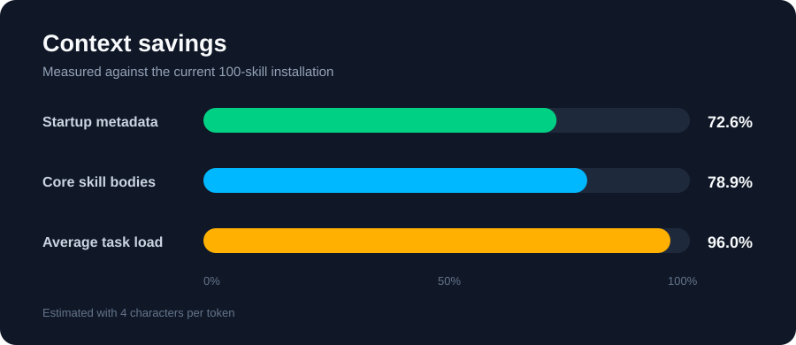

# Skill Catalog Sorter

A provider-neutral, progressive-disclosure router for Agent Skills.

It keeps only a compact name/description index in the agent's visible context,
selects the most relevant skills for a task, and lets Codex, Claude, Hermes, or
OpenCode load the full `SKILL.md` files only after selection.

  

## Install

```bash
git clone <this-repository> ~/.local/share/skill-catalog
ln -sfn ~/.local/share/skill-catalog/skill-catalog ~/.codex/skills/skill-catalog
ln -sfn ~/.local/share/skill-catalog/skill-catalog ~/.claude/skills/skill-catalog
```

Then add the routing instruction from `global-instructions/` to your Codex and
Claude global instruction files.

## Use

```bash
~/.local/share/skill-catalog/bin/skill-catalog prompt "review this React dashboard"
~/.local/share/skill-catalog/bin/skill-catalog prompt "review this React dashboard" --backend opencode
```

## Communication model

The sorter uses progressive disclosure:

```text
agent task
    -> skill-catalog
    -> skill metadata: name, description, tags, path
    -> local ranker OR OpenCode selector
    -> validated skill names and absolute SKILL.md paths
    -> agent reads only those SKILL.md files
```

The default `local` backend makes no model call. It tokenizes the task and
scores skill names, descriptions, tags, and source paths locally.

With `--backend opencode`, the sorter runs:

```text
opencode run "<task + compact JSON catalog>" --format json
```

OpenCode receives the task plus compact metadata only, never the full skill
documents. It must return JSON in this shape:

```json
{"skills": ["frontend-quality-review", "web-security-hardening"]}
```

The sorter rejects unknown names and turns the accepted names into paths. The
agent then loads the selected `SKILL.md` files itself.

## Local model configuration

No model is required for the normal local backend. Configure its inputs with
CLI options or environment variables:

```bash
export SKILL_CATALOG_ROOTS="$HOME/.agents/skills:$HOME/.codex/skills"
skill-catalog prompt "review this web app" --backend local --limit 3
skill-catalog prompt "review this web app" --cache-dir "$HOME/.cache/my-sorter"
skill-catalog prompt "review this web app" --no-cache
```

Ollama and llama.cpp are built-in local providers. They receive the same
compact request and return the same JSON response. Their endpoints and models
are configurable:

```bash
skill-catalog prompt "review this web app" --backend ollama --model qwen2.5:3b
skill-catalog prompt "review this web app" --backend llamacpp \
  --endpoint http://127.0.0.1:8080/v1/chat/completions --model local-model
```

Environment defaults are `SKILL_CATALOG_OLLAMA_URL`,
`SKILL_CATALOG_OLLAMA_MODEL`, `SKILL_CATALOG_LLAMACPP_URL`, and
`SKILL_CATALOG_LLAMACPP_MODEL`. Ollama defaults to its local `/api/chat`
service on port 11434. For llama.cpp, the sorter honors an explicit endpoint,
then probes ports from `SKILL_CATALOG_LLAMACPP_PORTS` (default: `8080,1234,8000`)
through `/v1/models` before selecting the first live server.

Every provider uses the same compact request and response contract:

```json
{
  "task": "review this web app",
  "catalog": [
    {"name": "frontend-quality-review", "description": "...", "tags": []}
  ],
  "output": {"skills": ["name"]}
}
```

The Ollama provider POSTs to `/api/chat`; the llama.cpp provider POSTs to
`/v1/chat/completions`. Neither provider receives or returns full `SKILL.md`
contents. This keeps model traffic local while preserving the same selector
contract.

Catalogs are cached per project under `~/.cache/skill-catalog/`. The project
path is hashed into the cache directory. The cache stores metadata and a
manifest, not full skill instructions, and is invalidated when roots or any
discovered `SKILL.md` file changes.

## Profile manager

`bin/skill_profile.py` creates a reversible core-skill profile for Codex or
Claude. It stores the previous directory as a timestamped backup and uses
symlinks so one source collection can serve both agents.

## Benchmark

Measure the context savings locally:

```bash
PYTHONPATH=bin python3 bin/benchmark_skill_context.py
```

The report compares the full skill bodies, the reduced core profile, the
metadata-only index, and the skills selected for representative tasks. It also
measures selector payload size, cold index-build time, warm-cache time, and
cache speedup. It prints estimated tokens using four characters per token,
plus ASCII bars for startup, core-profile, and task-load savings. These are
planning estimates; actual token counts vary by model tokenizer.

### Current results

Measured against the current 100-skill installation:

<p align="center">
  
</p>

```text
Startup metadata  [#######################.........]  72.6% saved
Core skill bodies [#########################.......]  78.9% saved
Average task load: ~9,497 tokens
Versus full catalog [###############################.]  96.0% saved
```

```text
Selector payload: ~5,177 tokens
Cold index build:   8.64 ms
Warm cache read:    3.04 ms
Cache speedup:       2.8x
```

Baseline comparison:

| Mode | Skills | Estimated tokens |
| --- | ---: | ---: |
| Full skill bodies | 100 | 237,766 |
| Core profile bodies | 20 | 50,104 |
| Full metadata index | 100 | 5,164 |
| Core metadata index | 20 | 1,417 |
| Average selected task load | 3 | 9,497 |

| Router metric | Result |
| --- | ---: |
| Selector metadata payload | ~5,177 tokens |
| Cold index build | 8.64 ms |
| Warm cache read | 3.04 ms |
| Cache speedup | 2.8x |

These figures come from one local benchmark run and token estimates use four
characters per token. Run the benchmark again after changing the installed
skills or machine to refresh the numbers.

## License

MIT
