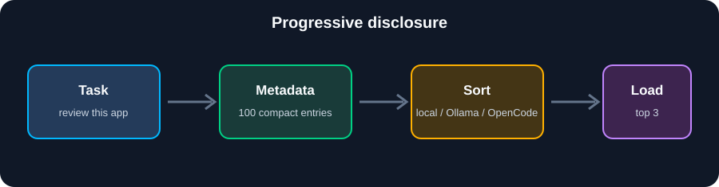

# Skill Catalog Sorter

A local context router for AI coding agents.

Skill Catalog Sorter is a provider-neutral, progressive-disclosure router for
Agent Skills. It prevents agents from loading every skill on every task by
selecting from compact metadata first, then loading only the relevant
`SKILL.md` files.

It keeps only a compact name/description index in the agent's visible context,
selects the most relevant skills for a task, and lets Codex, Claude, Hermes, or
OpenCode load the full `SKILL.md` files only after selection.

  

<div align="center">

## Current Results

The sorter keeps the agent's first decision small. It scans a compact metadata
index, selects only relevant skills, and lets the agent load full instructions
after selection. That means the model does not repeatedly ingest every skill
just to find the two or three it needs.


| Context reduction | Result |
| --- | ---: |
| Startup metadata | **72.6% saved** |
| Core skill bodies | **78.9% saved** |
| Average task load | **96.0% saved** |
| Warm-cache speedup | **2.7x** |

<p><strong>Measured baseline:</strong> 100 full skill bodies ≈ 237,766 tokens →
metadata index ≈ 5,164 tokens → average selected task ≈ 9,497 tokens.</p>

</div>

<p align="center">
  
</p>

### Legend & Methodology

| Term | Meaning |
| --- | --- |
| Full skill bodies | All **100 skills** discovered across the configured skill roots, with their complete `SKILL.md` instructions. |
| Core skill bodies | The **20 skills** in the reduced Codex/Claude core profile, measured with their complete instructions. These are the skills kept globally visible by default. |
| Metadata index | Names, descriptions, and tags for all 100 skills; full instructions are not included. |
| Average task load | The average full-body size of the top 3 skills selected for 4 representative queries. |
| Model used | **None.** The benchmark uses the deterministic local selector; OpenCode, Ollama, and llama.cpp are not called. |
| Token estimate | `(characters + 3) // 4`, a planning approximation rather than an exact model tokenizer count. |
| Cache test | A temporary per-project cache is measured once cold and once warm, then reported as a speedup. |

The benchmark runs with `PYTHONPATH=bin`, reads the current local/global skill
roots, and uses the same catalog that the sorter would route. Provider models
are only used when you explicitly run a task with `--backend opencode`,
`--backend ollama`, or `--backend llamacpp`; they are not part of these results.

### Run Your Own Benchmark

> **Make the numbers yours:** run this from the repository root after
> installing or changing skills.

It measures the actual catalog on your machine, including context sizes,
selector payload, cold build time, warm-cache time, and cache speedup:

```bash
PYTHONPATH=bin python3 bin/benchmark_skill_context.py
```

The token figures are planning estimates using four characters per token; the
timings are measured locally and will vary by machine and filesystem.

## Install

```bash
git clone git@github.com:Starryboyjosh/skill-catalog-sorter.git ~/.local/share/skill-catalog
ln -sfn ~/.local/share/skill-catalog/skill-catalog ~/.codex/skills/skill-catalog
ln -sfn ~/.local/share/skill-catalog/skill-catalog ~/.claude/skills/skill-catalog
```

Then add the routing instruction from `global-instructions/` to your Codex and
Claude global instruction files.

## Use

```bash
~/.local/share/skill-catalog/bin/skill-catalog prompt "review this React dashboard"
~/.local/share/skill-catalog/bin/skill-catalog prompt "review this React dashboard" --backend opencode
```

## Communication model

The sorter uses progressive disclosure:

```text
agent task
    -> skill-catalog
    -> skill metadata: name, description, tags, path
    -> local ranker OR OpenCode selector
    -> validated skill names and absolute SKILL.md paths
    -> agent reads only those SKILL.md files
```

The default `local` backend makes no model call. It tokenizes the task and
scores skill names, descriptions, tags, and source paths locally.

With `--backend opencode`, the sorter runs:

```text
opencode run "<task + compact JSON catalog>" --format json
```

OpenCode receives the task plus compact metadata only, never the full skill
documents. It must return JSON in this shape:

```json
{"skills": ["frontend-quality-review", "web-security-hardening"]}
```

The sorter rejects unknown names and turns the accepted names into paths. The
agent then loads the selected `SKILL.md` files itself.

## Local model configuration

No model is required for the normal local backend. Configure its inputs with
CLI options or environment variables:

```bash
export SKILL_CATALOG_ROOTS="$HOME/.agents/skills:$HOME/.codex/skills"
skill-catalog prompt "review this web app" --backend local --limit 3
skill-catalog prompt "review this web app" --cache-dir "$HOME/.cache/my-sorter"
skill-catalog prompt "review this web app" --no-cache
```

Ollama and llama.cpp are built-in local providers. They receive the same
compact request and return the same JSON response. Their endpoints and models
are configurable:

```bash
skill-catalog prompt "review this web app" --backend ollama --model qwen2.5:3b
skill-catalog prompt "review this web app" --backend llamacpp \
  --endpoint http://127.0.0.1:8080/v1/chat/completions --model local-model
```

Environment defaults are `SKILL_CATALOG_OLLAMA_URL`,
`SKILL_CATALOG_OLLAMA_MODEL`, `SKILL_CATALOG_LLAMACPP_URL`, and
`SKILL_CATALOG_LLAMACPP_MODEL`. Ollama defaults to its local `/api/chat`
service on port 11434. For llama.cpp, the sorter honors an explicit endpoint,
then probes ports from `SKILL_CATALOG_LLAMACPP_PORTS` (default: `8080,1234,8000`)
through `/v1/models` before selecting the first live server.

Every provider uses the same compact request and response contract:

```json
{
  "task": "review this web app",
  "catalog": [
    {"name": "frontend-quality-review", "description": "...", "tags": []}
  ],
  "output": {"skills": ["name"]}
}
```

The Ollama provider POSTs to `/api/chat`; the llama.cpp provider POSTs to
`/v1/chat/completions`. Neither provider receives or returns full `SKILL.md`
contents. This keeps model traffic local while preserving the same selector
contract.

Catalogs are cached per project under `~/.cache/skill-catalog/`. The project
path is hashed into the cache directory. The cache stores metadata and a
manifest, not full skill instructions, and is invalidated when roots or any
discovered `SKILL.md` file changes.

## Profile manager

`bin/skill_profile.py` creates a reversible core-skill profile for Codex or
Claude. It stores the previous directory as a timestamped backup and uses
symlinks so one source collection can serve both agents.

## License

MIT
